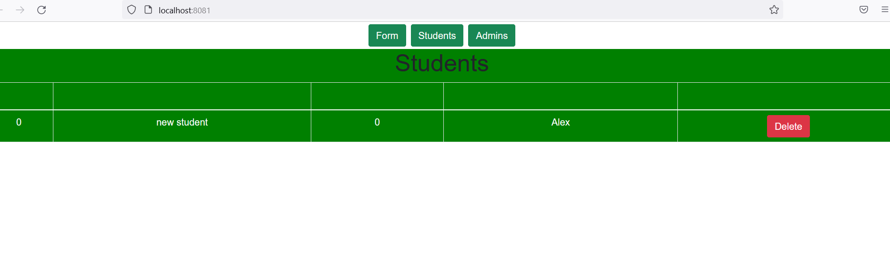

# VueJS - Lab 1





## Commands
- Install VueJS
```
$ npm i -g @vue/cli
```

- Create new project "lab1"
```
$ vue create lab1
```

- Run 
```
$ cd lab1
```
```
$ npm run serve
``` 

- Install bootstrap 
```
$ npm i bootstrap
```

# Author
* LinkedIn - [Mahmoud Mohamed Kamal](https://www.linkedin.com/in/mahmoudfierro98)

<p align="right">(<a href="#top">Top</a>)</p>
